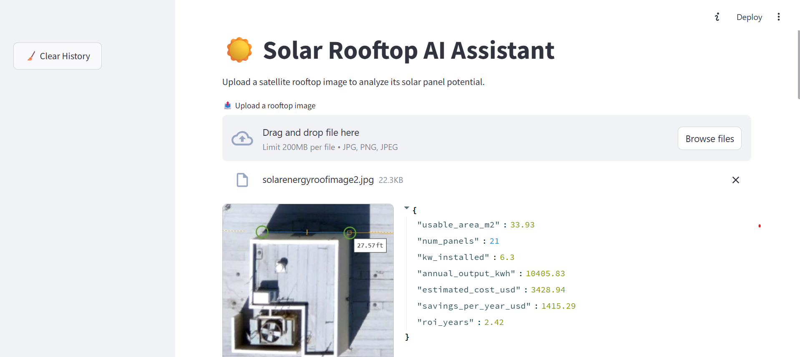
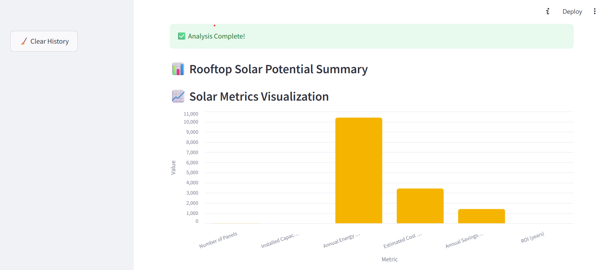
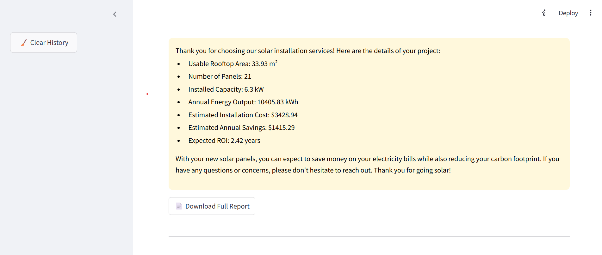

# ☀️ Solar Rooftop Analyzer

A Python/Flask web app that simulates rooftop solar potential analysis from uploaded images. It estimates usable rooftop area, number of solar panels, energy output, installation costs, yearly savings, and ROI using simulated data.

---

## 🚀 Project Setup Instructions

### Prerequisites
- Python 3.10 or newer
- `pip` package manager installed

### Installation Steps

```bash
# 1. Clone the repository
git clone https://github.com/your-username/solar-rooftop-analyzer.git
cd solar-rooftop-analyzer

# 2. (Optional) Create a virtual environment
python -m venv venv
source venv/bin/activate   # Windows: venv\Scripts\activate

# 3. Install dependencies
pip install -r requirements.txt

# 4. Run the application
python app.py
```

**Notes:**  
- The app runs a local Flask server, usually at http://127.0.0.1:5000/.  
- Supported image formats: `.jpg`, `.png`.  
- For any issues, check Python version and installed packages.

---

## ⚙️ Implementation Documentation

### Overview

The Solar Rooftop Analyzer simulates analyzing a rooftop image to estimate solar panel installation metrics.

### Main Components

1. **`analyze_image.py`**  
   Contains `analyze_image(image)` which:  
   - Simulates usable rooftop area (random between 20 and 80 m²).  
   - Calls utility functions to calculate:  
     - Number of solar panels.  
     - Installed kW.  
     - Annual energy output (kWh).  
     - Estimated installation cost.  
     - Savings per year.  
     - ROI period in years.  
   - Returns a dictionary with all values and their units.

2. **`utils.py`**  
   Contains helper functions:  
   - `calculate_num_panels(area_m2)` — Calculates how many panels fit into the area.  
   - `calculate_kw_installed(num_panels)` — Calculates total installed power in kW.  
   - `calculate_annual_output(kw)` — Estimates yearly energy production in kWh.  
   - `calculate_cost(kw)` — Estimates installation cost in USD.  
   - `calculate_savings(kWh)` — Calculates yearly savings based on production.  
   - `calculate_roi_years(cost, savings)` — Returns estimated ROI period.

3. **`app.py`**  
   Flask app to upload rooftop images, call `analyze_image`, and display results via HTML templates.

4. **Templates & Static**  
   - `templates/` contains HTML files for the UI.  
   - `static/` for CSS and JS if needed.

### Technology Stack

- Python 3.10+  
- Flask Web Framework  
- Random simulation (placeholder for real image processing)

---


## 💡 Example Use Cases

### Use Case 1: Homeowner Interested in Solar Potential

**Scenario:**  
A homeowner uploads an image of their rooftop to estimate solar energy production and financial benefits.

**Sample Output:**





```json
{
  "usable_area_m2": " 33.93 m²",
  "num_panels": "21 panels",
  "kw_installed": "6.3 kW",
  "annual_output_kwh": "10405.83 kWh",
  "estimated_cost_usd": "$3428.94",
  "savings_per_year_usd": "$1415.29",
  "roi_years": "2.42 years"
}
---

**Interpretation:**  
- The user can install about 21 solar panels.  
- Estimated yearly energy production is ~10405.83 kWh.  
- Installation cost is ~$3428.94  
- Expected savings are $1415.29per year.  
- ROI is estimated at about 9 years.

---

### Use Case 2: Solar Installer Preliminary Assessment

- Quickly generate estimates for clients.  
- Helps prepare initial quotes and feasibility reports.

---

## 🔮 Future Improvement Suggestions

### 1. Real Rooftop Detection with AI
- Use computer vision models (e.g., YOLOv8) for rooftop boundary detection in real photos.

### 2. GIS & Mapping Integration
- Integrate Google Maps or OpenStreetMap APIs for accurate rooftop layouts.

### 3. User Customization
- Allow users to input panel size, electricity rates, local incentives, etc.

### 4. Export Reports
- Generate downloadable PDF reports summarizing analysis and financials.

### 5. Environmental Impact
- Add CO₂ offset calculations for environmental benefits.

### 6. Multi-language Support
- Internationalize UI for non-English speakers.

### 7. Mobile App Version
- Develop a mobile app for on-the-go analysis.

---

## 📦 Project Deliverables

| Deliverable                  | Status |
|-----------------------------|--------|
| Complete codebase            | ✔️      |
| Implementation documentation | ✔️      |
| Example analyses            | ✔️      |
| Setup guide                | ✔️      |

---

## 📧 Contact

Developed by: Aritra Das
GitHub: https://github.com/aritrraa 
Email: aritradas405@gamil.com
---
